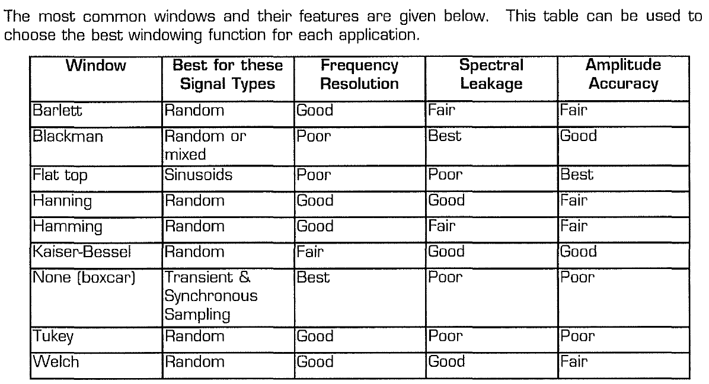
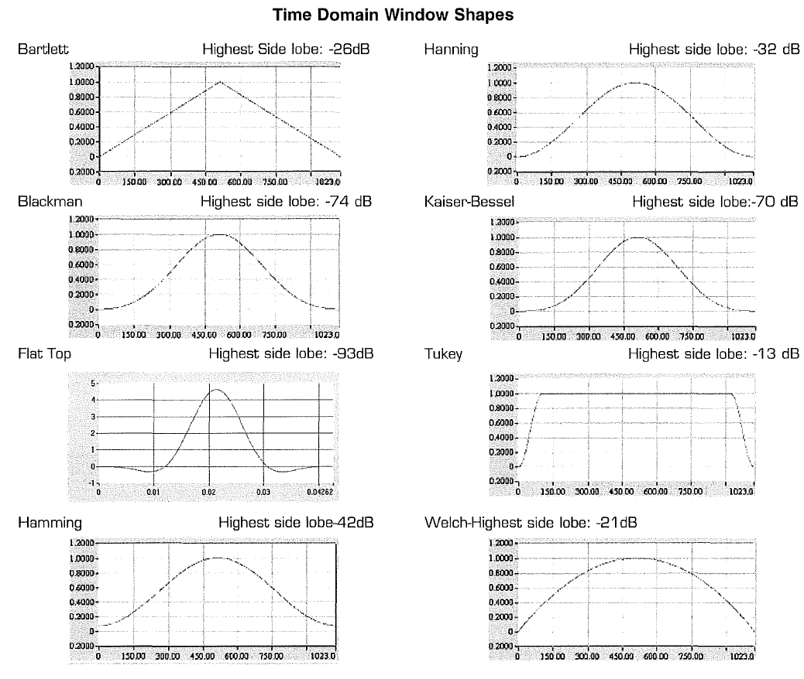

# Uppgift 3
___

## Vad krävs av deluppgifterna
Anteckningar och TODO:s för inlärning
### Deluppgift 1

### Deluppgift 2
### Deluppgift 3
### Deluppgift 4
### Deluppgift 5

## Resurser

Samlade egenskaper för olika windows

Samlade bilder för olika windows. Vi är intresserade av __Rektangulärt__-, __Hanning__- och
__Gaussian__-fönster

# Uppgift 4
De bekriver hur man kan uppleva ljude f.o.m sid 75 i application note 1.

# Uppgift 5
Soft/Hard-limiters finns sidan 217-220 i Sedra-Smith. 
